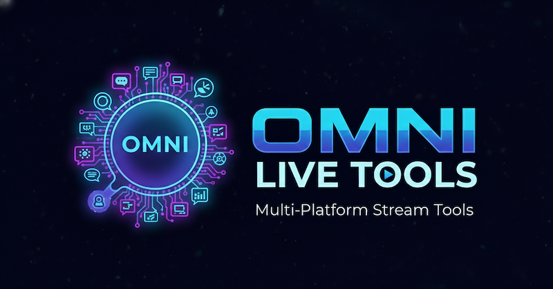
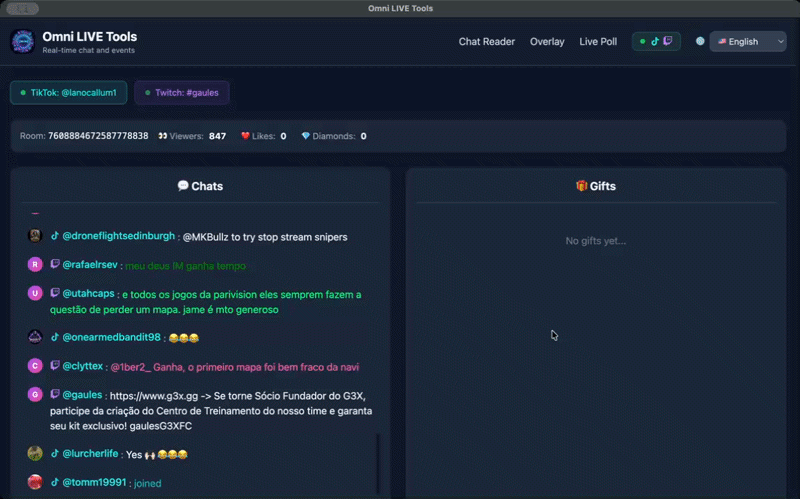

<div align="right">
  English | <a href="./README_PTBR.md">PT(BR)</a>
</div>

<div align='center'>
  
  <h1>Omni LIVE Tools</h1>
  <h3>A multi-platform toolkit for <strong>TikTok LIVE</strong>, <strong>Twitch</strong>, <strong>YouTube Live</strong>, and <strong>Kick</strong> streamers</h3>
   <a href="https://nodejs.org/"></a>
   <a href="https://www.typescriptlang.org/"></a>
   <a href="https://socket.io/"></a>
   <a href="https://www.electronjs.org/"></a>
   <a href="https://reactjs.org/"></a>
   <a href="https://jestjs.io/"></a>
</div>

## About

A multi-platform chat reader and poll application for **TikTok LIVE**, **Twitch**, **YouTube Live**, and **Kick** streams. Built with TypeScript using Clean Architecture principles. Available as a web server or desktop application (Electron).


## 📑 Table of Contents

- [Features](#-features)
- [Supported Platforms](#-supported-platforms)
- [Language Support](#-language-support)
- [Main Features](#-main-features)
   - [Poll Feature](#-poll-feature)
   - [Real-time Chat Reading](#-real-time-chat-reading)
- [Quick Start](#-quick-start)
- [Make Commands](#-make-commands)
- [Development](#-development)
- [Configuration](#-configuration)
- [Building Desktop App (Electron)](#-building-desktop-app-electron)
- [License](#-license)
- [Credits](#-credits)

## ✨ Features

- 💬 **Real-time Chat Reading** - Display chat messages from TikTok LIVE, Twitch, YouTube Live, and Kick instantly
- 📋 **Message Queue** - Add messages to a reading queue with one click for easy management during streams
- ⭐ **Featured Message Overlay** - Send messages to a dedicated overlay window for OBS with pop-out support
- 🌐 **Multi-Platform Support** - Connect to TikTok, Twitch, YouTube, and Kick simultaneously
- 🗳️ **Interactive Polls** - Create polls where viewers vote by typing numbers in chat (supports all platforms, pop-out works across pages)
- 📊 **Poll Profiles** - Save and load poll configurations with auto-save functionality
- 🎬 **OBS Overlay Support** - Dedicated overlay pages for streaming software with pop-out windows for chat, gifts, and queue
- 🔗 **Shared Connection Mode** - Overlays can reuse the main app's platform connections without reconnecting
- 🎁 **Gift Tracking** - Real-time gift display with streak tracking and timeout handling
- 👁️ **Customizable Visibility** - Toggle queue and gift panels on/off with persistent settings
- 🖥️ **Cross-platform Desktop App** - Standalone Electron app for Windows and macOS
- 🌍 **Multi-language Support** - Available in Portuguese (PT-BR), English (EN), and Spanish (ES) with in-app language selector
- 🏗️ **Clean Architecture** - Well-structured TypeScript codebase
- ⚡ **Rate Limiting** - Built-in protection against excessive requests
- 🔌 **Socket.IO Integration** - Real-time bidirectional communication
- 🔄 **Auto-Reconnect** - Automatic reconnection with visual indicator when connection is lost
- � **Stream End Detection** - Automatic notification when a stream ends on TikTok or YouTube
- �🔔 **Notification Sounds** - Audio feedback for poll events
- ✨ **Enhanced UI** - Neon glow effects, animations, and video splash screens
- 🧪 **Testing** - Comprehensive unit and integration tests with Jest and React Testing Library
- 🛠️ **Makefile** - Simplified development workflow with Make commands
- 📦 **Electron Builder** - Easy packaging and distribution of desktop applications
- 📝 **Changelog** - Detailed changelog with version history and release notes, available ([here](CHANGELOG.md))


## 🌐 Supported Platforms

| Platform | Chat Reading | Polls | Library |
|----------|-------------|-------|---------|
| TikTok LIVE | ✅ | ✅ | [TikTok-Live-Connector](https://github.com/zerodytrash/TikTok-Live-Connector) |
| Twitch | ✅ | ✅ | [@twurple/chat](https://twurple.js.org/) |
| YouTube Live | ✅ | ✅ | [youtubei.js](https://github.com/LuanRT/YouTube.js) |
| Kick | ✅* | ✅* | [@retconned/kick-js](https://github.com/retconned/kick-js) |

> *Kick support requires Google Chrome or Chromium installed on your system.

## 🌍 Language Support

The application supports multiple languages with easy switching:

| Language | Code | Status |
|----------|------|--------|
| Portuguese (Brazil) | PT-BR | ✅ Default |
| English | EN | ✅ Available |
| Spanish | ES | ✅ Available |

## ⭐ Main Features

### 🗳️ Poll Feature

The poll feature allows viewers to vote by typing numbers in chat from **TikTok LIVE** and/or **Twitch**.


#### How It Works

1. Select which platforms to use (TikTok, Twitch, YouTube, Kick, or any combination)
2. Connect to the live stream(s):
   - **TikTok**: Enter the streamer's @username
   - **Twitch**: Enter the channel name
   - **YouTube**: Enter the video ID or live stream URL
3. Configure your poll with 2-6 options
4. Set the timer duration (10-300 seconds)
5. Start the poll
6. Viewers vote by typing numbers (1, 2, 3, etc.) in the chat
7. Results update in real-time with platform badges showing vote sources

#### Features

- **Multi-platform voting** - Collect votes from TikTok, Twitch, YouTube, and Kick simultaneously
- **One vote per user per platform** - Each viewer can only vote once per poll per platform
- **Real-time results** - Vote counts and percentages update instantly with flash animation on changes
- **Platform badges** - Visual indicators show which platform each vote came from
- **Poll profiles** - Save and load poll configurations with auto-save and localStorage support
- **Autocomplete options** - Recent poll options are suggested as you type (up to 20 suggestions per option)
- **Results font size** - Customize the font size of poll results for better visibility (1x to 3x)
- **Duplicate validation** - Automatic detection and warning for duplicate poll options
- **Inline editing** - Double-click to edit poll questions and options directly
- **Configurable options** - Support for 2-6 poll options (default: 2)
- **Vote logging** - Optional detailed log of each vote with platform info
- **Timer display** - Countdown shows remaining time with glitch animation effects
- **Notification sounds** - Audio feedback when votes are received
- **Auto-reconnect** - Automatically reconnects if connection is lost during a poll
- **Neon glow effects** - Enhanced visual feedback with shake animations

### 💬 Real-time Chat Reading

The application reads chat messages from TikTok LIVE, Twitch, YouTube Live, and Kick in real-time, displaying them on a web page or OBS overlay.



#### How It Works

1. Connect to the live stream(s):
   - **TikTok**: Enter the streamer's @username
   - **Twitch**: Enter the channel name
   - **YouTube**: Enter the video ID or live stream URL
2. Chat messages from the selected platforms will appear in real-time on the main page and OBS overlay
3. Customize the display settings to show/hide usernames, badges, timestamps, etc.

#### Features

- **Multi-platform support** - Connect to TikTok, Twitch, YouTube, and Kick simultaneously
- **Display names** - Shows user's display name/nickname instead of handle for better readability
- **Message queue** - Hover over any message to add it to a reading queue; easily manage which messages to read
- **Featured message overlay** - Click the broadcast icon to send a message to a dedicated OBS overlay window
- **Pop-out overlay windows** - Separate pop-out windows for chat, gifts, and queue for flexible OBS integration
- **Smart auto-scroll** - Auto-scroll keeps up with high-volume chat; pauses when you scroll up to review messages, resumes when you scroll back down
- **Search/filter messages** - Quickly find messages by content, username, or nickname
- **SuperChat highlighting** - YouTube SuperChats are highlighted with a golden background and auto-added to queue
- **Member highlighting** - Channel members are highlighted with an emerald green background and star icon
- **Gift tracking with streaks** - Real-time gift display with streak tracking and timeout handling
- **Toggle visibility** - Show/hide queue and gift panels with persistent localStorage settings
- **Customizable display** - Show/hide usernames, badges, timestamps, etc.
- **OBS overlay** - Dedicated page optimized for streaming software with enhanced Twitch integration
- **Rate limiting** - Protect against excessive requests
- **Multi-language support** - Display messages in Portuguese (PT-BR), English (EN), or Spanish (ES)
- **Auto-reconnect** - Automatically reconnects if connection is lost
- **Smart connection modal** - Auto-closes when all selected platforms connect (only if any was disconnected), with manual close available after first connection


## 🚀 Quick Start

```bash
make install    # Install all dependencies
make dev        # Start development servers
```

## 🛠️ Make Commands

Run `make help` to see all available commands.

## 💻 Development

### Prerequisites

- Node.js 18+
- npm

### Running in Development Mode

```bash
make install          # Install all dependencies
make dev              # Start both backend and frontend dev servers
```

Or run them separately:

```bash
make backend-dev-watch   # Backend with auto-reload (:8081)
make frontend-dev        # Frontend dev server (:3000)
```

### Testing

```bash
make test             # Run all tests
make test-watch       # Run tests in watch mode
make test-coverage    # Run tests with coverage report
```

### Linting

```bash
make lint             # Run linters on both projects
make backend-lint-fix # Fix backend lint issues
```

## ⚙️ Configuration

Configure the application using environment variables:

| Variable | Default | Description |
|----------|---------|-------------|
| `PORT` | `8081` | Server port |
| `SESSIONID` | - | TikTok session ID (optional, for authenticated features) |
| `ENABLE_RATE_LIMIT` | `false` | Enable rate limiting |
| `MAX_CONNECTIONS` | `10` | Maximum concurrent TikTok connections |
| `MAX_REQUESTS_PER_MINUTE` | `5` | Rate limit threshold per client |
| `NODE_ENV` | `development` | Environment mode (`development` or `production`) |
| `STATIC_FILES_PATH` | `./dist-frontend` | Path to static frontend files |

You can set these in a `.env` file in the backend directory or export them in your shell.

## 📦 Building Desktop App (Electron)

Build standalone desktop applications for Windows and macOS:

```bash
make electron-dist    # Build distributable installers
```

### Build Output

Installers are created in `./release/`:

| Platform | Format |
|----------|--------|
| macOS | `.dmg`, `.zip` |
| Windows | `.exe` (NSIS installer + Portable) |

### Development Mode

```bash
make electron-dev     # Build & launch Electron in dev mode
```

## 📝 License

MIT License

## 🙏 Credits

- [tikTok-chat-reader-jb](https://github.com/filipe1309/tiktok-chat-reader-jb)
- Original project by [zerodytrash](https://github.com/zerodytrash/TikTok-Chat-Reader)

---

<p align="center">Made with ❤️ by <a href="https://github.com/filipe1309">Filipe</a></p>
